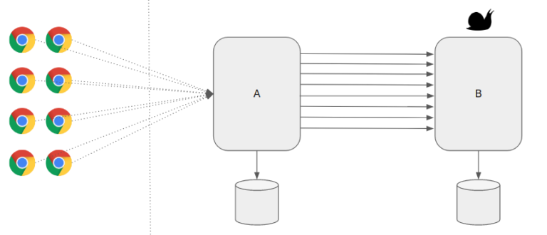
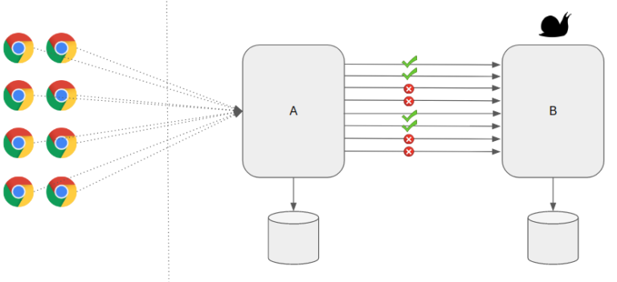

# Rate Limiter Pattern With Spring Boot

In this project, I would like to demonstrate **Rate Limiter Pattern**, one of the **Microservice Design Patterns** for designing highly resilient Microservices using a library called **resilience4j** along with **Spring Boot**.

## Need For Resiliency

Microservices are distributed in nature. When you work with distributed systems, always remember this number one rule – **anything could happen**. We might be dealing with network issues, service unavailability, application slowness etc. An issue with one system might affect another system behavior/performance. Dealing with any such unexpected failures/network issues could be difficult to solve.

Ability of the system to recover from such failures and remain functional makes the system more **resilient**. It also avoids any cascading failures to the downstream services.

## Rate Limiter Pattern

In Microservice architecture, when there are multiple services (A, B, C & D), one service (A) might depend on the other service (B) which in turn might depend on C and so on. Let’s consider this example. We have 2 services A and B.  Service A depends on Service B. The Service B has to do a lot of **CPU/IO intensive work** for the requests it receives. So it usually takes time to respond because of the nature of its work. Service B has a limit on max number of requests it can handle within the given time window.

Now the problem is – Service A receives a lot of requests occasionally and for every request if we depend on Service B, It could add too much load on Service B which could bring the service down. As a defensive measure, Service B wanted to protect itself from receiving too many requests by rejecting calls it can not handle.

**Rate Limiter Pattern** helps us to make our services highly available just by limiting the number of calls we could make/process in a specific window. In other words, It helps us to control the throughput. When we receive too many requests, the Service might simply reject the call. The client has to retry at a later time or can go with some default/cached values.

## Rate Limiter Pattern vs Circuit Breaker Pattern

Rate Limiter Pattern might sound same as **Circuit Breaker** in some cases. However there is an important difference!

- Rate Limiter helps to protect the server from over loading by controlling throughput.
- Circuit Breaker helps to keep the client safe and functional when the target server is failing / unresponsive.

## Sample Application

Lets consider a simple compute-service application which provides below endpoints.

- /double/{input}: doubles the given input. Unlimited calls allowed.
- /square/{input}: calculates the square of the given input. Limited calls only. Max 5 calls per minute.